# GrowthOps OS

**Marketing measurement, revenue reconciliation and lifecycle automation for a creator-led B2B business.**

[](https://github.com/KushPatel29/GrowthOps-OS/actions/workflows/ci.yml)
[](tests)
[](evals/narrative_guardrail_cases.json)

[**Live dashboard**](https://growthops-os.streamlit.app/) · [Power BI and Excel](docs/power-bi-handoff.md) · [Case study](docs/case-study.md) · [Metric catalog](docs/metric-catalog.md) · [API](docs/api-contracts.md) · [v2.1 specification](docs/growthops-os-v2.1-engineering-spec.md) · [HubSpot v2.1 change plan](docs/hubspot-v21-change-plan.md)

ScaleLab is a fictional coaching and education company that moved from a legacy CRM six months ago. Since
then nobody trusts the numbers: Meta, Google, LinkedIn, the CRM and the payment processor each report a
different revenue figure; lead volume is up but sales say leads got worse; some buyers email support
because they paid and never got access. GrowthOps OS answers the questions a marketing and revenue team
actually asks: **where did revenue come from, which number is right, what changed and why, and what should
we do this morning?**

Everything runs on fifteen months of **generated** data (14.7K contacts, 427 customers, $482K of ad spend,
$3.06M net cash) with incidents deliberately planted in it. The analytics have to find them, and the tests
check that they do.

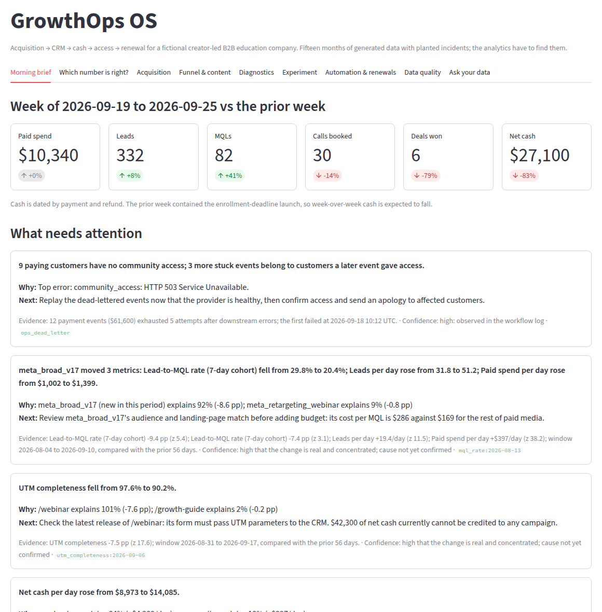

## What it finds

| Question | Answer from the data | How |
|---|---|---|
| **Which revenue number is right?** | Platforms claim $3.72M; the CRM books $3.32M; $3.06M was collected. Meta reports 7.3× ROAS; on net cash it is 3.3×. | Two exact bridges, platform claims → warehouse cash and CRM bookings → cash, every step computed, residual $0 ([`reconciliation.py`](growthops/reconciliation.py)) |
| **What changed and why?** | A new broad Meta campaign lifted leads 61% while the MQL rate fell from 29.8% to 20.4%; it explains 92% of the drop. | Rolling-window anomaly detection plus exact shift-share decomposition ([`diagnostics.py`](growthops/diagnostics.py)) |
| **Can we trust tracking?** | A landing-page release stripped UTMs from `/webinar`: completeness fell to 90.2% and $42K of cash lost its campaign. | Same detector on data quality, root-caused to a landing page |
| **Did every buyer get access?** | 9 launch-day buyers paid but have no community access after a six-hour provider outage. | Idempotent webhook engine with traces, backoff retries and a dead-letter queue ([`workflow.py`](growthops/workflow.py)) |
| **Is email still reaching people?** | Bulk sends moved to a new, unwarmed domain on 1 Sep: bounce rate 3.8% and complaints 0.16% (limits 2% and 0.1%); human opens fell from 27% to 15%, and all four enrollment-deadline promos went out on it. | Per-send deliverability check by sending domain; machine (privacy-proxy) opens excluded ([`email_analytics.py`](growthops/email_analytics.py)) |
| **Are our links tagged?** | 4 of 9 short links have missing, unregistered or off-taxonomy UTMs, and they carry 48% of recent short-link clicks. | Registry check on every Bitly-style link ([`campaign_links.py`](growthops/campaign_links.py)) |
| **Should we ship the new CTA?** | It lifts lead rate 50% (p < 0.001), but cash per visitor rests on 15 buyers and its interval spans zero. Keep the control. | Visitor-randomized test with a sample-ratio check and a bootstrap cash interval ([`experiments.py`](growthops/experiments.py)) |

The detector recovers **both planted incidents with the correct root cause within three days**; a test fails
if it ever stops doing so.

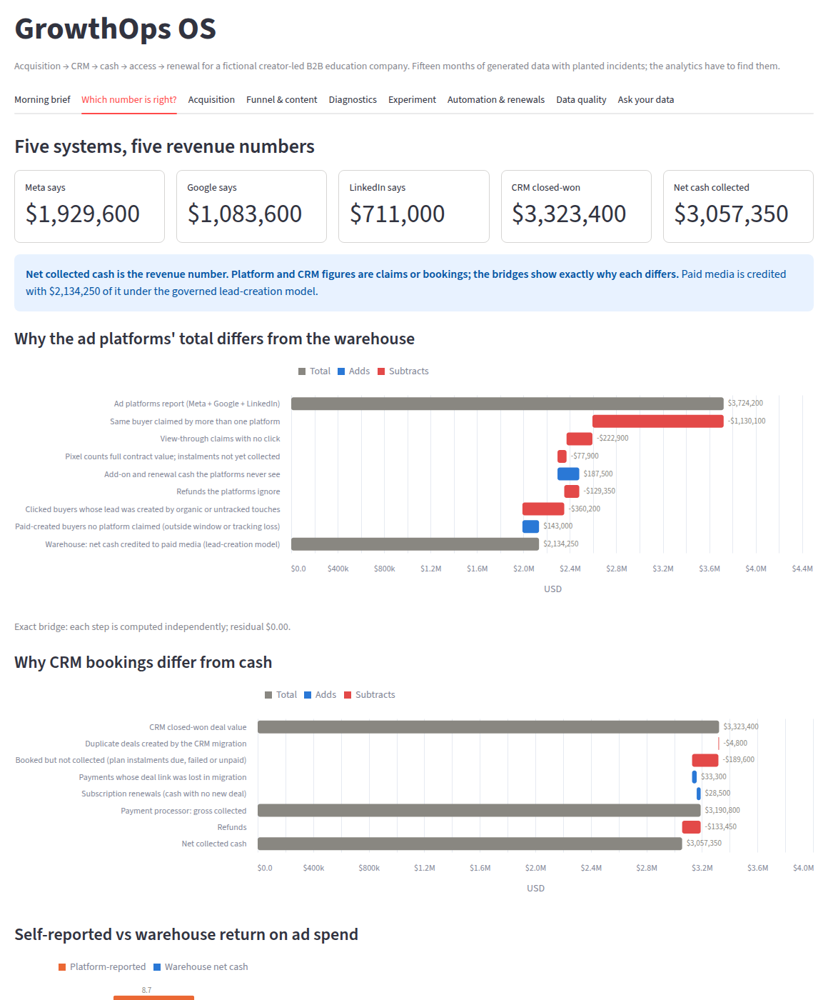

## What this demonstrates

| Skill a marketing data / growth analytics role asks for | Where it lives |
|---|---|
| Paid media efficiency: CPM, CTR, CPC, CPL, cost per MQL, cost per booked call, net-cash ROAS, funnel conversion by channel | Acquisition and Funnel views; [`performance.py`](growthops/performance.py), [`report.py`](growthops/report.py), [`funnel.py`](growthops/funnel.py) |
| Email analytics: delivery, bounce, human vs reported opens, CTR, click-to-open, unsubscribes, complaints, newsletter → pipeline, list source mix | Email & links view; [`email_analytics.py`](growthops/email_analytics.py), `mart_email_performance` |
| Clear written daily updates | `python -m growthops.performance`, `GET /metrics/daily-update`, copy block in the Morning brief |
| HubSpot, built live in a developer test account: 33 custom properties (UTM, content, funnel dates, tracking status, attribution), a funnel-stage deal pipeline, an Imports API load, a CRM API sync that writes only differences, lists, three published workflows, a CRM cleanup found through the search API, a four-report dashboard, and a read-back that reconciles the portal to the warehouse with zero differences | [`hubspot_portal.py`](growthops/hubspot_portal.py), [HubSpot portal build](docs/hubspot-portal.md), [`hubspot.py`](growthops/hubspot.py), [HubSpot mapping](docs/hubspot-mapping.md) |
| Attribution: first touch, lead creation, last non-direct, U-shaped, linear, all conserving cash to the cent | [`attribution.py`](growthops/attribution.py) |
| Reconciling ad platforms, CRM and payments after a migration | [`reconciliation.py`](growthops/reconciliation.py), [`migration.py`](growthops/migration.py) |
| UTM and short-link governance, tracking-quality monitoring | [`campaign_links.py`](growthops/campaign_links.py), `mart_link_hygiene`, measurement health, [tracking plan](docs/tracking-plan.md) |
| Explaining why a metric moved, in plain English, with an action | Morning brief ([`brief.py`](growthops/brief.py)) and Diagnostics view |
| Experimentation that optimizes cash, not vanity conversion | [`experiments.py`](growthops/experiments.py) |
| Content-to-pipeline analysis (views vs buyers) | Content section, `mart_content_performance` |
| SQL modelling and analytics engineering: dbt staging → intermediate → marts with data tests | [`warehouse/dbt`](warehouse/dbt), verified against the Python reference in CI |
| BI delivery: a 7-page Power BI report (214 described measures, SVG KPI tiles, a filter panel, a written summary computed in DAX) generated from a spec and verified in Desktop for the earlier baseline, and an Excel workbook driven by one window control with a campaign scorecard and 14 zero-difference audit checks; both read the same governed snapshot and agree to the cent | [Power BI and Excel](docs/power-bi-handoff.md), [`growthops/bi`](growthops/bi), [`export_excel.py`](growthops/export_excel.py), [measure reference](docs/power-bi-measures.md) |
| Lifecycle automation: payment → CRM → access, idempotency, retries, dead letters, operator replay | [`workflow.py`](growthops/workflow.py), [`api.py`](growthops/api.py) |
| Keyless, local AI: ask-your-data answers from governed metrics or cited definitions using BM25, with local MiniLM added when its verified model is preloaded. It reads the period, ad platform, campaign and measure a question names ("what did a lead cost on Google last month", "Meta vs Google CPL between July and August", "refund rate since the start of June", "spend in Q2", "compare net cash in July and August"), refuses untracked platforms, impossible dates and periods the data does not cover, says so when an answer cannot be cut by the period asked for, offers themed suggested questions and follow-ups, and is held to a 152-question contract that checks the details it read, the answer it chose and, for every period and platform answer, that the figure it states equals the mart, with zero wrong answers; no language model, no API key | [`ask_data.py`](growthops/ask_data.py), [`retrieval.py`](growthops/retrieval.py), [`evals/ask_questions.json`](evals/ask_questions.json) |
| Evidence-bound narrative: a validator rejects invented numbers, dates or causal claims in any draft; 30-case eval set | [`narrator.py`](growthops/narrator.py), [`evals/`](evals/narrative_guardrail_cases.json) |
| Production operation: fail-fast config, API keys, replay-safe signed webhooks, readiness and Prometheus metrics, migrations, verified backups, a worker for retries, alerts and the daily update, provider adapters (HubSpot, signed webhooks), non-root read-only containers | [runbook](docs/production-runbook.md), [security](docs/security.md), [`worker.py`](growthops/worker.py), [`adapters.py`](growthops/adapters.py) |

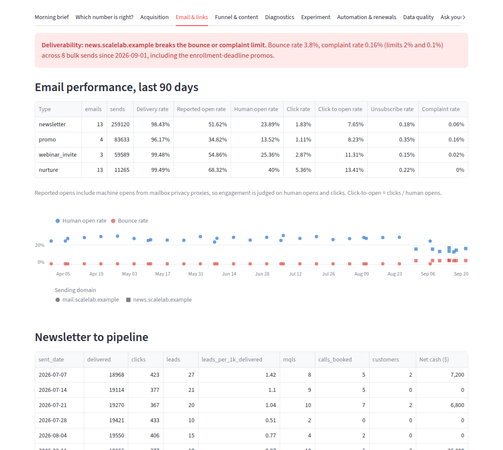

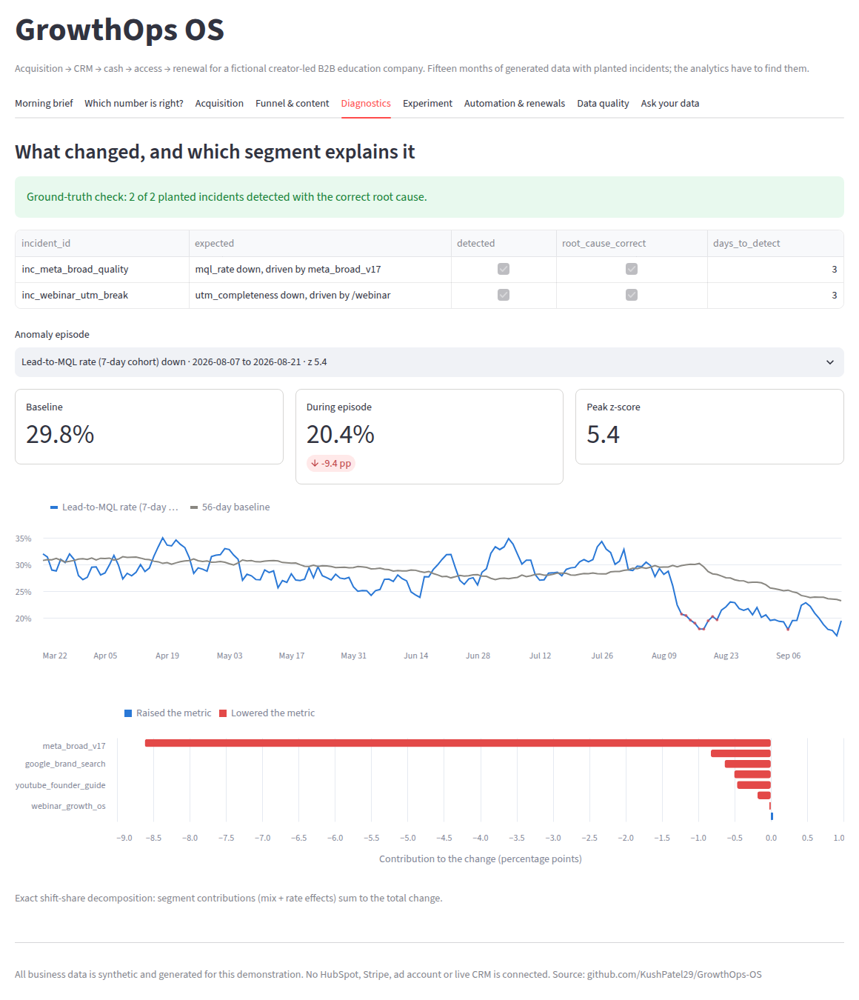

### Power BI and Excel

The same snapshot, twice. On its own, the report's DAX summary and the workbook's formula summary both name `meta_broad_v17` as the weakest campaign at scale (8.3% of leads qualify) and flag email bouncing at 3.4%.

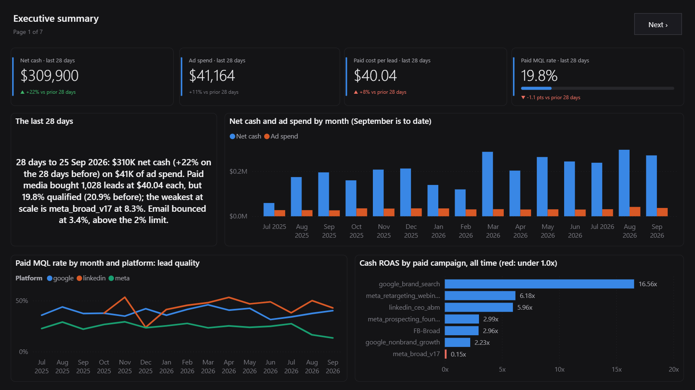

| | |
|---|---|
| 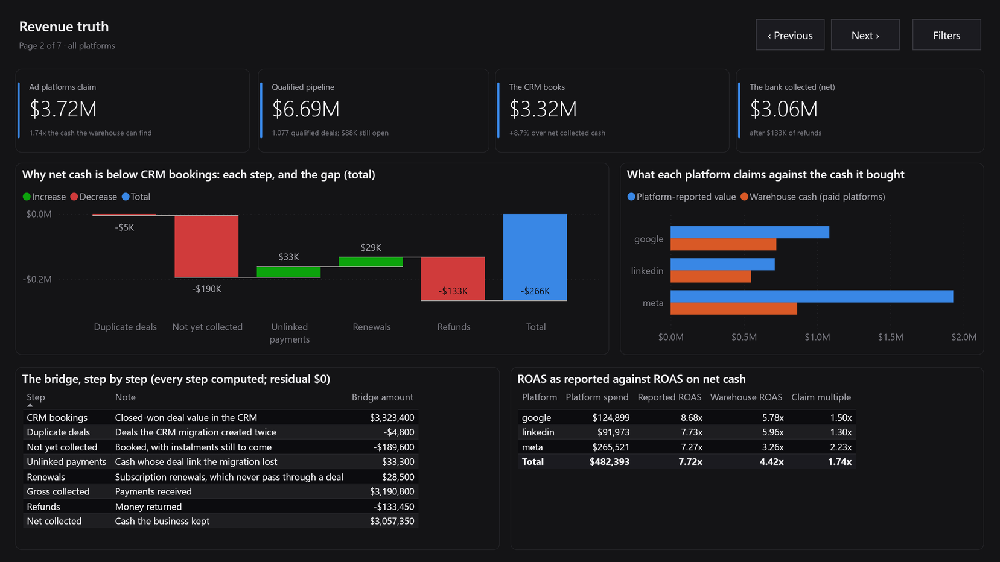 | 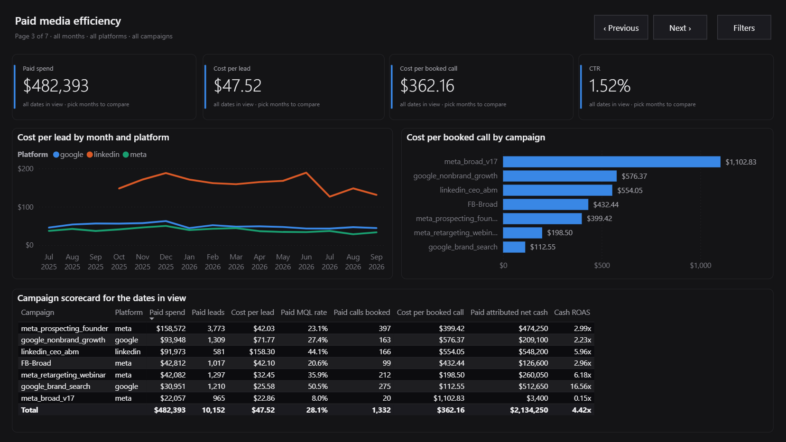 |
| 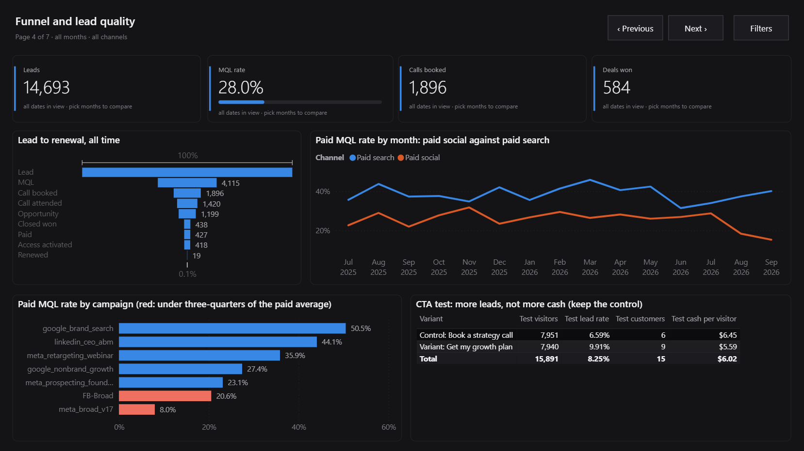 | 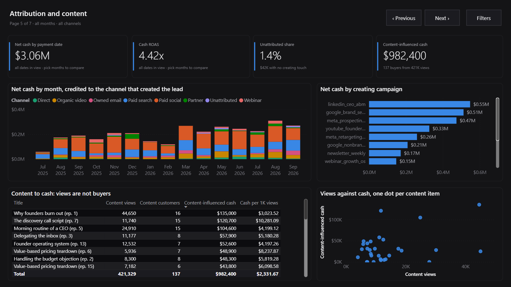 |
| 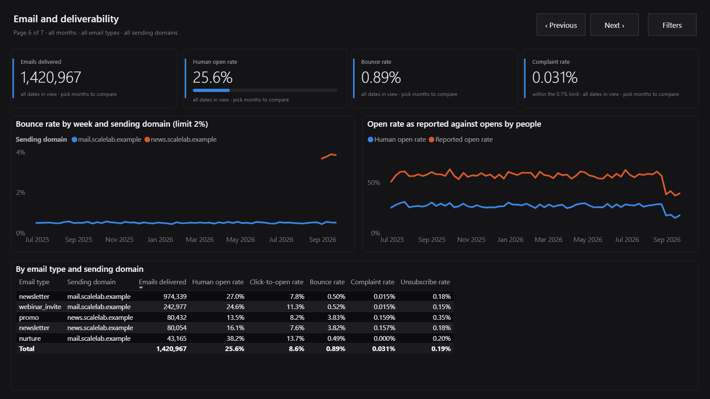 | 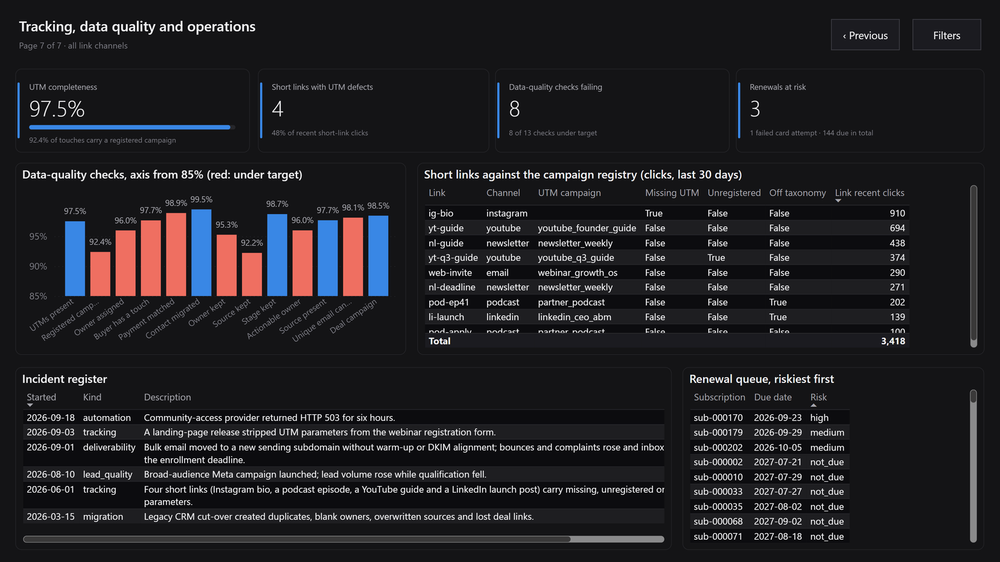 |

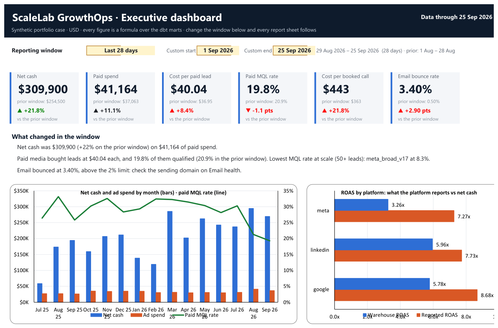

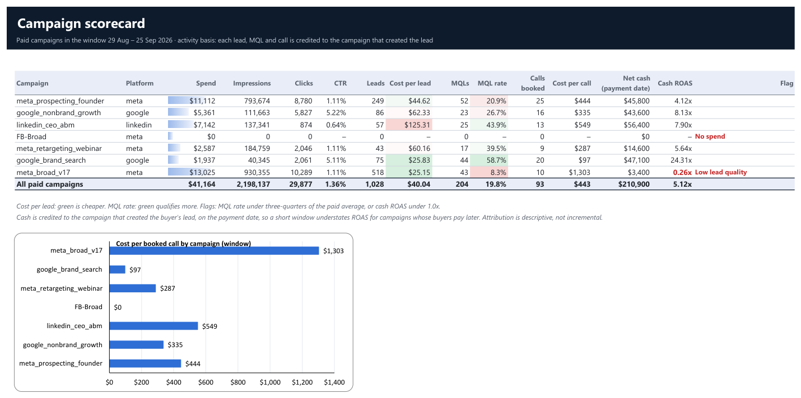

## Architecture

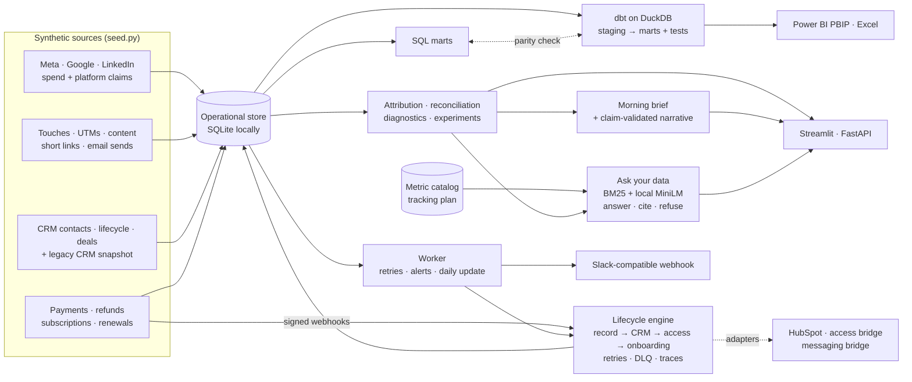

SQLite (WAL, versioned migrations, verified backups) holds operational state and DuckDB runs the dbt
warehouse, so everything runs with no credentials. `compose.yaml` runs the API, worker and dashboard as
non-root, read-only containers; the [production runbook](docs/production-runbook.md) covers configuration,
service levels, alerts, backups and incidents, and names when to move to PostgreSQL.

## Run it

```bash
python -m pip install -e ".[dev,warehouse]" -r requirements.txt
python -m streamlit run streamlit_app.py            # the dashboard (generates data on start)
python -m pytest                                    # full local test suite
```

Full pipeline, as CI runs it:

```bash
python -m growthops.seed --database data/growthops-sample.db       # 15 months, ~3 s, deterministic
python -m growthops.warehouse --database data/growthops-sample.db  # SQL marts
python -m growthops.export_warehouse                               # dbt seeds
(cd warehouse/dbt && dbt seed --profiles-dir . --full-refresh && dbt build --profiles-dir .)
python -m growthops.verify_dbt                                     # DuckDB marts == Python reference
python -m growthops.export_bi --refresh-pbip                     # BI snapshot + generated Power BI project
python -m growthops.export_excel --recalculate                   # Excel workbook, calculated in Excel (Windows)
python -m growthops.narrator --eval                                # 30/30 guardrail cases
python -m growthops.case_study                                     # regenerate docs/case-study.md
python -m growthops.performance                                    # the written daily update
python -m growthops.hubspot --output build/hubspot                 # HubSpot import files + CRM audit
python -m growthops.hubspot_portal plan                             # what a HubSpot portal build would create (offline)
python -m growthops.hubspot_v21 audit                                # read-only live property drift audit
python -m growthops.hubspot_v21 plan                                 # five-field v2.1 schema proposal (offline)
python -m growthops.hubspot_portal apply                            # build + verify a HubSpot test account (HUBSPOT_ACCESS_TOKEN)
python -m growthops.ask_data --eval                                # question contract, keyword + hybrid
python -m growthops.ask_data "What does a lead cost on Google?"    # ask from the command line
python -m growthops.worker --once                                  # retries, alerts, daily update
python -m uvicorn growthops.api:app --reload                       # API + /dashboard + /v2/console
```

Useful endpoints: `/metrics/brief`, `/metrics/daily-update`, `/metrics/paid-efficiency`, `/metrics/email`,
`/metrics/link-hygiene`, `/crm/hubspot/audit`, `/metrics/revenue-truth`, `/metrics/anomalies`, `/metrics/narrative`,
`/ask?q=`, `/ask/suggestions`, `/ops/workflows`, `/ops/paid-without-access`, `/ops/events/{id}`,
`/v2/console`, `/v2/decision-center`, `/v2/crm/health`, `/v2/crm/marketing-contacts/audit`,
`/v2/campaigns/qa`, `/v2/instrumentation/validate`, `/v2/quality/issues`,
`/v2/metrics/qualified-pipeline`, `/v2/ops/incidents`, `/v2/ops/customers/{person_key}`,
`/v2/ops/events/{event_id}`, signed `/v2/webhooks/lifecycle`, `/ready`, `/metrics` (Prometheus).
Production: `cp .env.example .env`, fill in the secrets, then `docker compose up -d` (see the
[runbook](docs/production-runbook.md)). Local embeddings need `pip install -e ".[rag]"`; without them ask-your-data
runs keyword-only and says so.

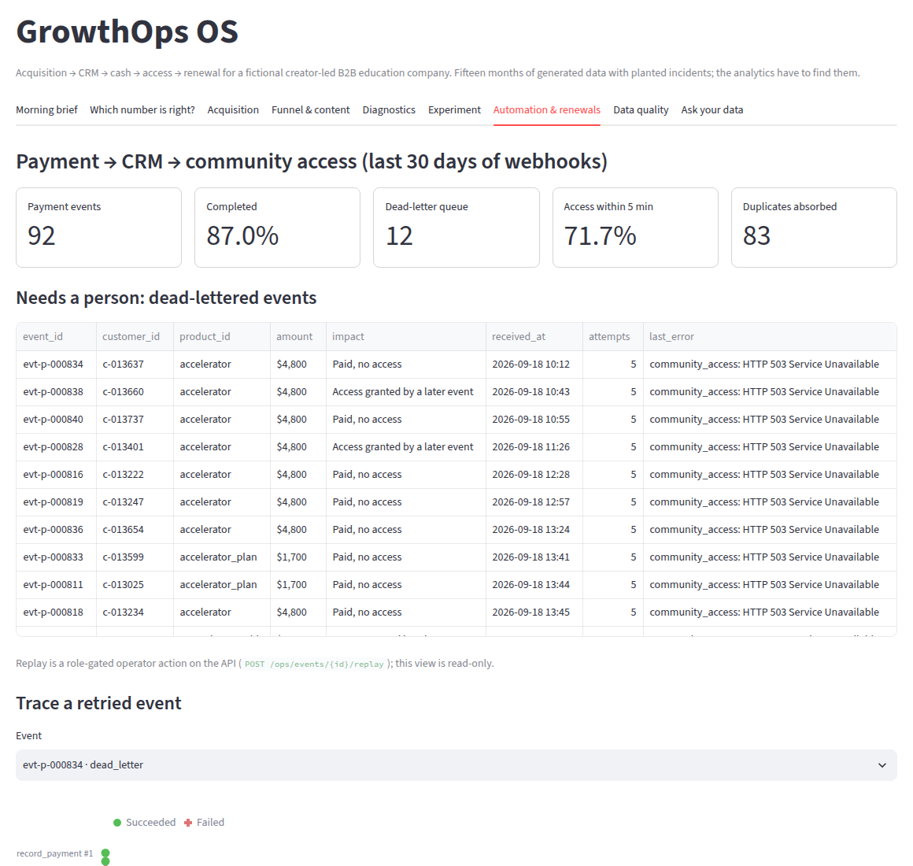

## How it is kept honest

- **Nothing is hand-typed.** The case study, the whole Power BI project (model, measures, pages, theme) and the
  Excel workbook are generated from the code; CI fails if any committed copy drifts. The headline figures in this
  README are recomputed by a test, so they cannot go stale either.
- **Every total ties out.** All attribution models sum to net cash; both revenue bridges have zero residual;
  the Excel audit sheet's 14 checks all equal zero; dbt marts match the Python reference; the workbook's
  calculated values equal the same figures computed in Python, and Power BI's equal both.
- **Ground truth.** The generator records the incidents it plants (`incidents` table); tests assert the
  detector finds each one with the right root cause.
- **No model in the loop.** Ask-your-data retrieves; it never generates. Numbers come from governed functions,
  definitions from the committed metric catalog, and the question contract fails CI on any wrong answer, including
  a right answer that states the wrong figure or the wrong period.
- **No causal overreach.** Drivers are arithmetic shares of a change; recommendations are phrased as checks.
  Attribution is descriptive, not incremental.

**Data provenance:** every person, transaction and campaign is synthetic. No real company's
data or systems are used. A HubSpot developer test account holds a deterministic synthetic sample and is
documented in [the portal build](docs/hubspot-portal.md). The runtime HubSpot and webhook adapters are
tested against a fake HTTP transport; no live Stripe, ad-platform or community provider is connected.
Current state and limits: [PROJECT_STATUS.md](PROJECT_STATUS.md).
