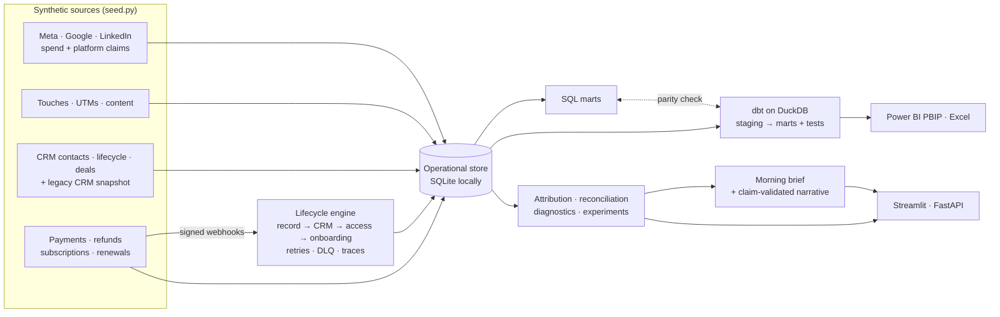

# GrowthOps OS

**Marketing measurement, revenue reconciliation and lifecycle automation for a creator-led B2B business.**

[**Live dashboard**](https://growthops-os.streamlit.app/) · [Case study](docs/case-study.md) · [Metric catalog](docs/metric-catalog.md) · [API](docs/api-contracts.md)

ScaleLab is a fictional coaching and education company that moved from a legacy CRM six months ago. Since
then nobody trusts the numbers: Meta, Google, LinkedIn, the CRM and the payment processor each report a
different revenue figure; lead volume is up but sales say leads got worse; some buyers email support
because they paid and never got access. GrowthOps OS answers the questions a marketing and revenue team
actually asks: **where did revenue come from, which number is right, what changed and why, and what should
we do this morning?**

Everything runs on fifteen months of **generated** data (14.7K contacts, 427 customers, $482K of ad spend,
$3.06M net cash) with incidents deliberately planted in it. The analytics have to find them, and the tests
check that they do.


## What it finds

| Question | Answer from the data | How |
|---|---|---|
| **Which revenue number is right?** | Platforms claim $3.72M; the CRM books $3.32M; $3.06M was collected. Meta reports 7.3× ROAS; on net cash it is 3.3×. | Two exact bridges, platform claims → warehouse cash and CRM bookings → cash, every step computed, residual $0 ([`reconciliation.py`](growthops/reconciliation.py)) |
| **What changed and why?** | A new broad Meta campaign lifted leads 61% while the MQL rate fell from 29.8% to 20.4%; it explains 92% of the drop. | Rolling-window anomaly detection plus exact shift-share decomposition ([`diagnostics.py`](growthops/diagnostics.py)) |
| **Can we trust tracking?** | A landing-page release stripped UTMs from `/webinar`: completeness fell to 90.2% and $42K of cash lost its campaign. | Same detector on data quality, root-caused to a landing page |
| **Did every buyer get access?** | 9 launch-day buyers paid but have no community access after a six-hour provider outage. | Idempotent webhook engine with traces, backoff retries and a dead-letter queue ([`workflow.py`](growthops/workflow.py)) |
| **Should we ship the new CTA?** | It lifts lead rate 50% (p < 0.001), but cash per visitor rests on 15 buyers and its interval spans zero. Keep the control. | Visitor-randomized test with a sample-ratio check and a bootstrap cash interval ([`experiments.py`](growthops/experiments.py)) |

The detector recovers **both planted incidents with the correct root cause within three days**; a test fails
if it ever stops doing so.


## What this demonstrates

| Skill a marketing data / growth analytics role asks for | Where it lives |
|---|---|
| Paid, organic and email performance: CPL, cost per MQL, ROAS, funnel conversion by channel | Acquisition and Funnel views; [`report.py`](growthops/report.py), [`funnel.py`](growthops/funnel.py) |
| Attribution: first touch, lead creation, last non-direct, U-shaped, linear, all conserving cash to the cent | [`attribution.py`](growthops/attribution.py) |
| Reconciling ad platforms, CRM and payments after a migration | [`reconciliation.py`](growthops/reconciliation.py), [`migration.py`](growthops/migration.py) |
| UTM governance and tracking-quality monitoring | [`campaign_links.py`](growthops/campaign_links.py), measurement health, [tracking plan](docs/tracking-plan.md) |
| Explaining why a metric moved, in plain English, with an action | Morning brief ([`brief.py`](growthops/brief.py)) and Diagnostics view |
| Experimentation that optimizes cash, not vanity conversion | [`experiments.py`](growthops/experiments.py) |
| Content-to-pipeline analysis (views vs buyers) | Content section, `mart_content_performance` |
| SQL modelling and analytics engineering: dbt staging → intermediate → marts with data tests | [`warehouse/dbt`](warehouse/dbt), verified against the Python reference in CI |
| BI delivery: Streamlit, Power BI (PBIP/TMDL) and a formula-driven Excel workbook, all rebuilt from the same marts | [`dashboards/`](dashboards), [`export_bi.py`](growthops/export_bi.py), [`export_excel.py`](growthops/export_excel.py) |
| Lifecycle automation: payment → CRM → access, idempotency, retries, dead letters, operator replay | [`workflow.py`](growthops/workflow.py), [`api.py`](growthops/api.py) |
| Responsible AI: an LLM may only rewrite evidence it is given, and a validator rejects invented numbers, dates or causal claims; 30-case eval set | [`narrator.py`](growthops/narrator.py), [`evals/`](evals/narrative_guardrail_cases.json) |


## Architecture



The local build uses SQLite for operational state and DuckDB for the warehouse so it runs anywhere with no
credentials. The [implementation blueprint](docs/implementation-blueprint.md) describes the production
target (PostgreSQL, BigQuery or Postgres + dbt, real provider adapters).

## Run it

```bash
python -m pip install -e ".[dev,warehouse]" -r requirements.txt
python -m streamlit run streamlit_app.py            # the dashboard (generates data on start)
python -m pytest                                    # 46 tests, about 30 seconds
```

Full pipeline, as CI runs it:

```bash
python -m growthops.seed --database data/growthops-sample.db       # 15 months, ~3 s, deterministic
python -m growthops.warehouse --database data/growthops-sample.db  # SQL marts
python -m growthops.export_warehouse                               # dbt seeds
(cd warehouse/dbt && dbt seed --profiles-dir . --full-refresh && dbt build --profiles-dir .)
python -m growthops.verify_dbt                                     # DuckDB marts == Python reference
python -m growthops.export_bi --refresh-pbip && python -m growthops.export_excel
python -m growthops.narrator --eval                                # 30/30 guardrail cases
python -m growthops.case_study                                     # regenerate docs/case-study.md
python -m uvicorn growthops.api:app --reload                       # API + /dashboard
```

Useful endpoints: `/metrics/brief`, `/metrics/revenue-truth`, `/metrics/anomalies`, `/metrics/narrative`,
`/ops/workflows`, `/ops/paid-without-access`, `/ops/events/{id}`. Docker: `docker compose --profile tools run
--rm seed && docker compose up api`. An optional Claude-written narrative (`pip install -e ".[ai]"`,
`python -m growthops.narrator --claude`) is shown only if it passes the claim validator.


## How it is kept honest

- **Nothing is hand-typed.** The case study, Power BI partitions and Excel workbook are generated from the
  code; CI fails if any committed copy drifts.
- **Every total ties out.** All attribution models sum to net cash; both revenue bridges have zero residual;
  the Excel audit sheet's checks all equal zero; dbt marts match the Python reference.
- **Ground truth.** The generator records the incidents it plants (`incidents` table); tests assert the
  detector finds each one with the right root cause.
- **No causal overreach.** Drivers are arithmetic shares of a change; recommendations are phrased as checks.
  Attribution is descriptive, not incremental.

**Data provenance:** every person, transaction and campaign is synthetic. No real company's
data or systems are used, and no provider (HubSpot, Stripe, ad platforms, community platform) is connected.
Current state and limits: [PROJECT_STATUS.md](PROJECT_STATUS.md).
