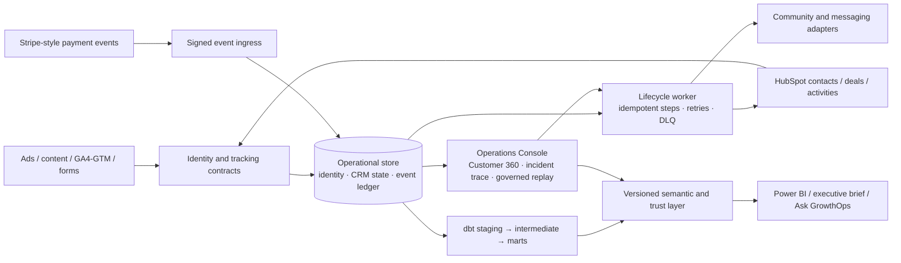

# GrowthOps OS v2.1 engineering specification

**Status:** implementation contract, 2026-09-29. **Product:** Full-Funnel Revenue Intelligence, CRM Operations & AI Automation Platform.

GrowthOps OS connects acquisition, identity, HubSpot, sales pipeline, payments, entitlements, measurement and operator action. It remains a **synthetic portfolio system**. ScaleLab is fictional; the connected HubSpot portal is a developer test account. This document specifies work to build, not a claim that the target integrations or features already run.

The product boundary is deliberate: HubSpot remains the CRM, Stripe remains payment truth, GA4 remains web telemetry, and ad platforms remain acquisition systems. GrowthOps owns the cross-system identity, event ledger, governed metrics, reconciliation, workflow state, investigation and controlled actions. The two demo paths are acquisition → qualified pipeline → cash → decision, and payment → CRM → access → failed step → replay → recovery. This scope reflects the [Marketing Data Analyst](https://job-boards.greenhouse.io/martellgrowthsolutions/jobs/5435680008) and [Automation & AI Developer](https://job-boards.greenhouse.io/martellgrowthsolutions/jobs/5247998008) role descriptions without implying employment or access to Martell systems.

## 1. Baseline and decisions

| Area | Running today | v2.1 increment |
|---|---|---|
| Data | Deterministic 15-month ScaleLab scenario, SQLite operational store, DuckDB/dbt marts | Anonymous-to-contact identity evidence, explicit SQL/qualified pipeline, event/media and consent fixtures |
| CRM | 33 baseline custom properties, five empty v2.1 fields, a GrowthOps deal pipeline, six lists, three workflows and 959 synthetic contacts (plus two HubSpot sample contacts) in a HubSpot developer test portal as of 2026-09-29; CRM audit and sync code | Versioned property/workflow registries, lifecycle policy, CRM Health Center, drift checks and proposed repairs |
| Revenue | Platform/CRM/cash bridges, payment/refund attribution, five attribution models | Qualified pipeline as a separate value, customer-level reconciliation and operator-facing exception queue |
| Automation | Signed payment webhook, idempotent new/installment/renewal flows, retries, step traces, DLQ and replay | Cancel/refund/upgrade/downgrade policies, event envelope, correlation IDs, outbox, action audit and Customer 360 |
| Decision | Streamlit, FastAPI, seven-page Power BI project, morning brief, governed ask-your-data and guardrail evals | One Decision Center route, role-specific investigations, classification pipeline and versioned LLM evals |
| Deployment | Local Compose API/worker/dashboard, SQLite WAL, CI and backups | Optional GCP topology after the local contracts pass; PostgreSQL/BigQuery are targets, not current dependencies |

Source of truth for the running state: [project status](../PROJECT_STATUS.md), [portal evidence](hubspot-portal.md), [API contracts](api-contracts.md) and [metric catalog](metric-catalog.md). The older [implementation blueprint](implementation-blueprint.md) contains a broad 39-table target; this specification narrows the next release to additions that can be demonstrated and verified. The live portal has a 1,000-contact test-account cap and holds a deterministic sample, so portal counts must never be presented as the full synthetic population.

**Architecture choice:** extend the existing FastAPI application and worker as a modular monolith. Separate modules and durable contracts before adding deployable services. SQLite + DuckDB remain the reproducible local path. Move the operational store to PostgreSQL only when concurrent writers, multi-host operation or recovery objectives require it; use BigQuery only for a managed warehouse demonstration. Do not run two competing semantic definitions.



### Nonfunctional targets for the synthetic release

- Every cash bridge has zero residual in integer minor units; unresolved attribution is a named bucket. Each published metric exposes grain, cohort basis, date window, currency, source freshness, metric version and definition link.
- Repeating a provider event or retrying after a provider accepted an action produces no duplicate business side effect. Delivery is **at least once with idempotent effects**, not a claim of distributed exactly-once execution.
- A failed external step is visible by event and correlation ID with attempt history, next retry, customer impact and an authorized replay path. Permanent validation failures go to review rather than endless retry.
- All demo data is synthetic. Public BI exports contain no email, phone, raw webhook payload, API token or provider secret. Raw payload access has a retention limit and an audit trail.
- Initial local acceptance uses the existing test and CI gates. Suggested service objectives for a future hosted deployment are 99.9% API availability and p95 successful entitlement provisioning within five minutes; these are **targets**, not measured claims.

## 2. Service boundaries and ownership

| Module | Owns | Reads / emits | Does not own |
|---|---|---|---|
| Ingestion and instrumentation | Canonical event validation, source IDs, time normalization, UTM taxonomy and raw payload reference | GA4/GTM, ads, forms, HubSpot and payment adapters → versioned events | CRM or payment truth |
| Identity | Person key, external-ID links, evidence and ambiguity queue | Touches, forms, contacts, payment IDs → resolved person link | Silent fuzzy merges |
| CRM operations | Property/workflow registries, lifecycle policy, health checks and repair proposals | HubSpot snapshots and history → quality issues | Arbitrary bulk lifecycle or marketing-status changes |
| Lifecycle orchestrator | Event state, outbox, step state, retry and replay | Payment/subscription events → CRM, entitlement, messaging and analytics events | Provider billing state |
| Analytics and trust | dbt models, metric definitions, attribution, reconciliation and quality tests | Operational/raw data → certified marts | Mutating source systems |
| Decision and AI | Briefs, grounded answers, classification, evals and operator UI | Certified marts and evidence IDs → explanations and proposals | Unreviewed external actions |

Adapters have typed interfaces for CRM, payment, community access and messaging. The community interface is `grant_access(person_key, product_id, idempotency_key)`, `change_tier(...)` and `revoke_access(...)`; the local implementation is a mock. A Mighty Networks adapter is a later option. A development-only Stripe snapshot bridge now verifies test signatures and translates allowlisted events with explicit local ID metadata; it has been tested with fixtures, not a connected Stripe account.

## 3. Data contracts and migration path

Keep existing `contacts`, `touches`, `lifecycle_events`, `deals`, `payments`, `refunds`, `subscriptions`, `processed_events`, `workflow_steps` and `workflow_step_attempts`. Add versioned migrations; do not replace the local schema or rewrite the generator. The tables below are the **minimum additions** for v2.1. IDs are opaque strings locally and UUIDs in a PostgreSQL deployment. Timestamps are UTC ISO-8601; money is integer minor units plus ISO currency code.

| Table / grain | Key and required columns | Constraint or purpose |
|---|---|---|
| `persons` / one resolved person | `person_key` PK, `created_at`, `resolution_version`, `status` | Stable internal key; no PII required in the analytics copy |
| `identity_links` / one external identifier | `(source_system, id_type, id_hash)` unique, `person_key` FK, `first_seen_at`, `last_seen_at`, `evidence_event_id`, `confidence`, `rule_version`, `state` | Conflicting links enter `ambiguous`; never merge on name alone |
| `lifecycle_transitions` / one accepted transition | `transition_id` PK, `person_key` FK, `from_stage`, `to_stage`, `occurred_at`, `source_event_id`, `policy_version`, `owner_id`, `campaign_id` | Unique source event; records history without erasing current HubSpot state |
| `deal_qualification` / one qualification decision | `decision_id` PK, `deal_id` FK, `qualified_at`, `status`, `reason`, `amount_minor`, `currency`, `source_event_id`, `policy_version` | Explicit criteria; no inference from merely booking a call |
| `event_outbox` / one intended side effect | `outbox_id` PK, `event_id` FK, `destination`, `action`, `idempotency_key` unique, `payload_ref`, `status`, `next_attempt_at`, `attempts` | Durable handoff around external calls |
| `operator_actions` / one requested action | `action_id` PK, `actor_id`, `action_type`, `target_type`, `target_id`, `reason`, `before_hash`, `after_hash`, `requested_at`, `result` | Audit replay, repair and sync; no secrets in rows |
| `quality_issues` / one rule/entity/version | `issue_id` PK, `rule_id`, `entity_type`, `entity_id`, `severity`, `first_seen_at`, `last_seen_at`, `state`, `evidence_ref` | Stable issue identity supports reopening and resolution |
| `consent_ledger` / one channel decision | `consent_id` PK, `person_key`, `channel`, `status`, `source`, `recorded_at`, `evidence_ref` | Marketing eligibility is evidence-based, never inferred from a lifecycle stage |
| `registry_versions` / one approved config version | `registry_type`, `version` PK, `definition_json`, `owner`, `approved_at`, `effective_at` | Holds campaign, property, workflow, lifecycle and instrumentation contracts |
| `engagement_events` / one normalized media event | `event_id` PK, `person_key` nullable, `anonymous_id` nullable, `platform`, `content_id`, `event_type`, `occurred_at`, `duration_seconds`, `source_event_id` | Zoom/YouTube/Vimeo fixtures use one grain and preserve unresolved identity |

Extend `processed_events` rather than creating a second event ledger: add `source`, `source_event_id`, `schema_version`, `entity_type`, `entity_id`, `correlation_id`, `idempotency_key` and `payload_ref`; retain its present canonical `event_id` primary key, `payload_sha256`, status, attempt and trace fields. For newly ingested events, `(source, source_event_id)` is unique. Migrate old rows with `source='growthops_legacy'`, set `source_event_id` to their old ID and preserve their canonical IDs. Do not silently reinterpret old `payment.succeeded` payloads. Make the raw payload optional in the main table after moving it to a restricted, time-limited store.

**Identity resolution order:** verified provider ID or HubSpot contact ID; authenticated form submission linking an anonymous session; verified email match within one tenant; otherwise unresolved. Store each supporting observation and rule version. If two existing person keys compete, quarantine the link and surface an issue. A salted email hash is a lookup aid, not proof of identity. Attribution keeps an unassigned bucket until the link is resolved.

**Lifecycle policy v1:** `subscriber → lead → mql → sql → opportunity → customer`, then renewal/expansion as events rather than stages. Backward moves and `lead → customer` require an explicit correction or payment/deal evidence and an audit record. Stage timestamps come from source events; `contacts.current_stage` remains a materialized projection. The existing synthetic scenario has lead/MQL/opportunity/customer, so SQL is a new explicit milestone and historical rows may remain `unknown`.

### Event envelope and delivery semantics

```json
{
  "schema_version": "2.1",
  "event_id": "go_evt_001",
  "source_event_id": "evt_001",
  "event_type": "payment.completed",
  "source": "stripe_test_bridge",
  "occurred_at": "2026-09-29T09:41:00Z",
  "received_at": "2026-09-29T09:41:01Z",
  "correlation_id": "go_01J8...",
  "entity": {"type": "payment", "id": "pay_001"},
  "idempotency_key": "stripe_test_bridge:evt_001",
  "payload_ref": "restricted://events/evt_001",
  "payload_sha256": "64-hex-character-sha256"
}
```

The current signed `POST /webhooks/payments` and `PaymentEvent` are v1. A bridge maps provider events into the v2.1 envelope and a versioned typed payload. The first supported types are `payment.completed`, `payment.failed`, `refund.created`, `subscription.started`, `subscription.renewed`, `subscription.upgraded`, `subscription.downgraded`, `subscription.cancelled`, `lead.created`, `lead.qualified`, `meeting.booked`, `deal.closed_won` and `access.granted/revoked`. Unknown versions are rejected to a visible queue.

**Instrumentation and UTM registry:** version each event name, trigger, required parameters, conversion flag and owner. Initial web contract: `page_view(page_path, anonymous_id)`, `video_start(content_id, anonymous_id)`, `lead_form_submit(form_id, submission_id, anonymous_id)`, `meeting_booked(meeting_id, person_key)` and `checkout_started(product_id, person_key)`. `purchase` is emitted from the payment bridge with `transaction_id`, `currency`, `value_minor` and `product_id`; a browser pixel is never payment truth. Campaign links carry canonical `utm_source`, `utm_medium`, `utm_campaign`, optional `utm_content`/`utm_term`, and registry IDs for campaign, creative and landing page. The existing `POST /campaign-links` is the local validator; v2.1 adds a registry version and a QA result for missing, unknown, case-mismatched or off-taxonomy values. Conversion export back to ad platforms is deferred and would require consent, provider policy review and deduplication IDs.

For every event: validate signature and timestamp; persist the inbox row and intended outbox actions in one transaction; claim work with a lease; execute one idempotent provider action at a time; persist result and attempt trace; retry 429/5xx/timeouts with jittered backoff; park deterministic 4xx/schema/identity conflicts for review. Provider idempotency keys are stable `event_id:action:version`. A worker crash after a provider call may cause a repeated call, so every adapter must demonstrate idempotency in tests. Operator replay records actor/reason and resumes failed steps only. A refund or cancellation cannot revoke access until the entitlement policy confirms no other active paid entitlement.

## 4. HubSpot CRM contract

The existing [developer portal build](hubspot-portal.md) is the test fixture. It has a GrowthOps sales pipeline, 33 baseline custom properties, five [v2.1 schema fields](hubspot-v21-change-plan.md), six lists and three workflows. It is not a production marketing portal; all imported test contacts are non-marketing and HubSpot reports their original traffic source as Offline. The custom source/UTM fields retain the synthetic registry values. The portal has no tickets, campaigns or capture forms. No bulk marketing-contact change, attribution overwrite or retroactive lead-source claim is allowed without consent and source evidence.

| Object | Existing mapping | v2.1 field / rule |
|---|---|---|
| Contact | `growthops_contact_id`, original/latest UTM, first/lead/last campaign, tracking status, owner, content and funnel dates | `growthops_person_key` for tested identity links; `growthops_sql_date` only on evidence; consent remains in restricted ledger and HubSpot eligibility is checked before any marketing-status action |
| Deal | GrowthOps sales pipeline, contact association, amount, first/lead campaign and product | `growthops_qualification_status`, `growthops_qualified_at`, `growthops_qualification_reason`; qualified pipeline reads these, with open-stage and currency rules |
| Campaign | Custom campaign strings on contacts/deals; zero HubSpot Campaign objects | Versioned registry maps campaign IDs/UTMs to future HubSpot Campaign objects; creating objects and associations is a separate approved operation |
| Workflow | Three published test workflows | Registry records trigger, target, owner, version, enabled state, last verification and drift; changes use a plan → approval → apply → read-back path |
| Property | 33 baseline custom properties and five empty v2.1 fields | Registry stores type, enum set, source of truth, owner, PII class, requiredness and change history; detect schema drift before sync |

The CRM Health Center reports **counts and denominators**, not only a score: owner completeness for actionable leads, source/UTM completeness, contact/deal association coverage, duplicate candidates, invalid stage transitions, open deals without activity, deals lacking campaign and marketing-contact eligibility evidence. A score may be shown as a weighted rollup only if the weights and exclusions are visible; each defect links to evidence and a proposed repair. Sample contacts and developer-portal limits are labeled.

The two role stories must be explicit: marketing sees qualified pipeline by source and UTM repair priorities; operations sees payment-to-CRM-to-access traces, workflow/property drift and safe replay. Existing HubSpot stages must be read back before any proposed pipeline change. Do not equate `Discovery call attended` with SQL without qualification evidence.

## 5. Metric and dbt contracts

The [metric catalog](metric-catalog.md) remains canonical. Add these definitions, then implement one SQL reference and one dbt model with parity checks:

| Metric | Formula and grain | Guardrail |
|---|---|---|
| SQLs | Distinct persons with a first accepted `sql` transition in the cohort window | Unknown historical SQL stays unknown |
| Qualified opportunities | Distinct deals with an accepted qualification decision | A deal counts once at first qualification |
| Qualified pipeline created | Sum deal amount at first qualification, in one reporting currency | Open/closed outcome is a separate slice; no mixing currencies |
| Open qualified pipeline | Sum current amount of qualified deals still open at as-of time | As-of snapshot, not booked or cash revenue |
| Booked revenue | Sum closed-won deal value at close date | Existing definition; no payment implication |
| Gross / net cash | Captured payments / captured payments less refunds by event date | Existing payment truth; refunds inherit payment attribution |
| Cost per SQL / opportunity | Paid spend divided by attributed SQL people / qualified deals in a mature cohort | Null on zero denominator; state lag and attribution model |
| Pipeline ROAS | Qualified pipeline created attributed to paid campaigns / paid spend | Label as pipeline value, never revenue |
| CRM health dimensions | Passing eligible records / eligible records for each named rule | No opaque denominator; test-account sample stated |
| Automation success / time to access | Unique completed events / accepted events; receipt-to-entitlement latency | Duplicate deliveries do not inflate either side |

**Revenue Truth Layer:** show four different numbers: platform-reported value, qualified pipeline, CRM booked revenue and net collected cash. The platform number may overlap across platforms. Report two bridges separately: platform claims → warehouse-attributed cash, and CRM closed-won bookings → payment/refund cash. Explanations are typed causes (window, view-through, duplicate, partial payment, refund, unmatched deal/payment, FX, late arrival) with record-level evidence. Do not imply a causal lift from descriptive attribution.

Add to `warehouse/dbt` in dependency order:

```text
stg_identity_links + stg_engagement_events + stg_deal_qualification
      → int_person_resolution → int_lifecycle_transitions
      → int_qualified_pipeline → int_payment_entitlement_reconciliation
      → mart_funnel_cohorts + mart_qualified_pipeline
      → mart_customer_360 + mart_crm_health + mart_operations_health
      → existing campaign / revenue / content / measurement marts
```

Every new model declares grain, owner, description, tests and freshness. Critical tests: unique external event IDs, one canonical person per verified identifier, no unresolved link silently joined, allowed lifecycle transitions, qualification decision uniqueness, qualification before or at close, deal-contact association, payment/refund bounds, entitlement after a paid event, campaign taxonomy, cash conservation and Python/dbt parity. The reporting tables carry `data_as_of`, `metric_version`, `identity_version` and unresolved counts.

**BI semantic model:** extend the existing generated PBIP, not a new hand-built dashboard. Use conformed Date, Campaign, Person (pseudonymous), Product and Stage dimensions with explicit one-to-many relationships; keep payment-grain cash separate from deal-grain pipeline to prevent fanout. New measures are Qualified Pipeline Created, Open Qualified Pipeline, Cost/SQL, Cost/Opportunity, Pipeline ROAS, Stage Leakage and Time to Access. Add drill-through from Decision Center → CRM health issue or operations trace. Executive pages display quality/freshness warnings when a measure's inputs fail.

## 6. API and Operations Console contracts

Retain existing endpoints in [API contracts v0.3](api-contracts.md). New routes are versioned under `/v2` to avoid silently changing existing consumers. All responses include `request_id`, `data_as_of` where analytic, and stable error codes.

| Route | Response / action | Access |
|---|---|---|
| `GET /v2/people/{person_key}/journey` | Identity evidence, ordered touches, lifecycle, deals, payments and unresolved links | Operator; PII redacted by default |
| `GET /v2/ops/customers/{person_key}` | Customer 360: CRM IDs, cash, subscription, entitlement, last workflow trace and renewal | Operator |
| `GET /v2/ops/events/{event_id}` | Envelope, correlation ID, step attempts, provider status, retry/DLQ state and impact | Operator |
| `POST /v2/ops/events/{event_id}/replay` | Requires reason and idempotency key; returns action ID and state | Privileged operator, audited |
| `GET /v2/quality/issues` | Paginated filter by rule, severity, entity, state and as-of | Analyst/operator |
| `POST /v2/quality/issues/{issue_id}/propose-repair` | Dry-run diff and evidence only | Analyst/operator |
| `GET /v2/crm/health` | Rule counts, denominators, score components, sample scope and freshness | Analyst/operator |
| `GET /v2/metrics/qualified-pipeline` | Cohort, model, currency, open/created/won split and source links | Analyst |
| `GET /v2/metrics/revenue-truth` | Four values, two bridges, residuals and exceptions | Analyst |
| `GET /v2/registries/{kind}/versions` | Approved property, workflow, campaign, lifecycle or event schema definitions | Operator |

The Operations Console has four initial views: **Decision Center** (brief, pipeline/cash, trust alerts), **Customer 360** (one person and journey), **Incident Trace** (correlation path and retry state) and **Quality Queue** (evidence and dry-run repairs). Search accepts an opaque person key or an authorized email lookup; logs store a keyed hash of the lookup, not the email. Actions require role checks and a visible preview. Local demo uses simulated roles; a hosted deployment needs real identity and RBAC.

## 7. Synthetic generator, AI and evaluation

Extend the existing deterministic 15-month generator through a **separate random stream** so current headline figures and tests remain stable. Add anonymous sessions and form links, verified/ambiguous identity pairs, explicit SQL decisions, stage reversals, partial payments, upgrade/downgrade/cancel/refund events, competing entitlements, consent changes, media engagements and provider failure/recovery cases. Store the planted truth in a fixture inaccessible to production metrics. Golden scenarios include a UTM loss, a duplicate identity, a paid-without-access case, a retry after provider acceptance, a refund with another active entitlement, and an unqualified open deal. Do not grow the dataset for scale alone.

AI has three separate contracts:

1. **Classification:** a batch job labels synthetic sales conversations (pain, objection, intent, timing, decision authority, outcome) into a versioned schema with span evidence and an `unknown` option. Raw transcripts stay restricted.
2. **Explanation:** the brief receives a deterministic evidence packet with metric IDs, windows, numerator/denominator, driver decomposition, quality flags and source links. It may explain only those facts; otherwise it falls back to the current deterministic brief.
3. **Ask GrowthOps:** existing governed question routing remains the default. New questions about qualified pipeline, CRM gaps and workflow failures route to allowlisted functions and expose metric, filters, period, lineage and confidence. No free-form warehouse SQL or external action from a chat answer.

Keep existing 152-question ask contract and 30 guardrail cases. Add a held-out, versioned suite of at least 100 cases across classification, brief and copilot, including sparse/conflicting evidence, arithmetic, citations, date windows and refusals. Release gates: every numeric claim matches its evidence packet; zero unsupported external actions; zero unsupported factual claims in the held-out brief set; classification macro-F1 target ≥0.85 on labeled synthetic cases, reported with per-label confusion. An LLM provider is optional; tests also run without keys and verify deterministic fallback.

## 8. Deployment and release plan

**Local reference topology:** existing Docker Compose API + worker + dashboard on one persistent SQLite volume; DuckDB/dbt jobs build marts and generated Power BI snapshots. This is the required path for reviewers and CI. Add migration and outbox tests before parallel workers.

**Optional GCP topology:** HTTPS load balancer → Cloud Run API; Cloud SQL PostgreSQL for operational state; Pub/Sub as a wake-up transport for a Cloud Run worker (outbox remains the durable authority); Cloud Scheduler for reconciliation/dbt jobs; BigQuery for warehouse marts; Secret Manager for provider keys; Cloud Logging/Monitoring for traces and alerts; object storage for restricted payloads and backups. Deploy with least-privilege service accounts, encrypted storage, signed webhooks, migration rollback and an explicit cost cap. No production provider access is required for the portfolio demo.

| Milestone | Deliverable | Acceptance evidence |
|---|---|---|
| **M0: freeze baseline** | Snapshot current API/metrics/portal evidence and correct stale documentation | Existing tests pass; current and target claims are labeled |
| **M1: identity + semantics (P0)** | Person key, link evidence, lifecycle policy, SQL and qualified pipeline contracts | Ambiguous joins stay unresolved; cohort and cash tests pass |
| **M2: CRM operations (P0)** | Registries, HubSpot drift audit, CRM Health Center and quality queue | Portal read-back matches sample; no inferred bulk edits |
| **M3: lifecycle control (P0)** | Versioned event envelope, refund/cancel/upgrade policy, outbox, Customer 360, trace and audited replay | Duplicate and crash-after-provider tests show one business effect; planted outage recovers |
| **M4: decision layer (P0)** | Four-value revenue truth, qualified pipeline, Decision Center and PBIP measures | All monetary values tie to source and bridge residual is zero |
| **M5: intelligence (P1)** | Conversation classifier, evidence-bound brief and new eval suite | Gates above pass; keyless fallback remains usable |
| **M6: optional depth (P2)** | Renewal actions, media adapters, conversion routing, customer economics and GCP deployment | Each feature has a source contract, test fixture and independent demo |

**M3 implementation note (2026-09-29):** the local signed canonical route now handles
upgrade, downgrade, cancellation and refund events on the shared ledger with scoped
subscription entitlements, refund bounds, provider idempotency, retry and trace. The
community adapter remains simulated by default. A development-only Stripe test
snapshot route verifies the provider's signature and maps allowlisted events;
connected test-account delivery, source subscription read-back and live provider verification remain open.

Start with M0–M4. Markov attribution, a Chrome extension, large RAG corpus, many live integrations and forecasting remain deferred until the two end-to-end demos work. A server-side conversion router, when added, uses consent and provider policy checks, stable conversion IDs and deduplication; it never sends synthetic events to a live ad account.

### Demonstration acceptance

1. A visitor starts anonymous, submits a form, becomes a HubSpot contact, reaches MQL and an **explicit** SQL qualification, creates qualified pipeline, closes won and pays. The UI shows the full journey, source evidence, four value concepts and attribution uncertainty.
2. A signed payment event updates CRM and grants access. A simulated access provider 503 causes retry and then DLQ; the Incident Trace shows exactly which step failed. An authorized replay succeeds without recording a second payment or duplicate entitlement.
3. A tracking defect reduces source completeness. The brief flags the missing evidence, the Quality Queue names affected records and a dry-run repair explains what it would change. No attribution is fabricated.
4. A reviewer can regenerate the data, dbt marts, Power BI project and eval results locally from documented commands, then compare them to committed evidence.

## 9. Risks and decisions to revisit

| Decision | Current choice | Revisit when |
|---|---|---|
| SQLite vs PostgreSQL | Keep SQLite for single-host demo and existing migration path | Concurrent writers, multi-host deploy or point-in-time recovery is required |
| DuckDB vs BigQuery | DuckDB/dbt is the portable CI truth | Managed ingestion volume and budget justify BigQuery |
| HubSpot source attribution | Preserve custom UTM registry beside HubSpot's Offline import source | Real tracked forms and consented first-party web events exist |
| Identity linkage | Evidence-based deterministic rules with an ambiguity queue | Privacy review, new identifiers or acceptable false-merge rate changes |
| Campaign objects | Registry first; HubSpot Campaign creation as approved follow-up | Assets, ownership, time bounds and mapping are known |
| AI provider | Deterministic and keyless path is mandatory | LLM eval gates pass and a provider budget is approved |

**Definition of done:** the two demo stories pass from source event to governed decision/action; the operator can locate a broken seam by correlation ID; CRM and marketing claims distinguish synthetic test-portal evidence from product targets; documentation, tests, dbt and PBIP all use the same metric definitions.
