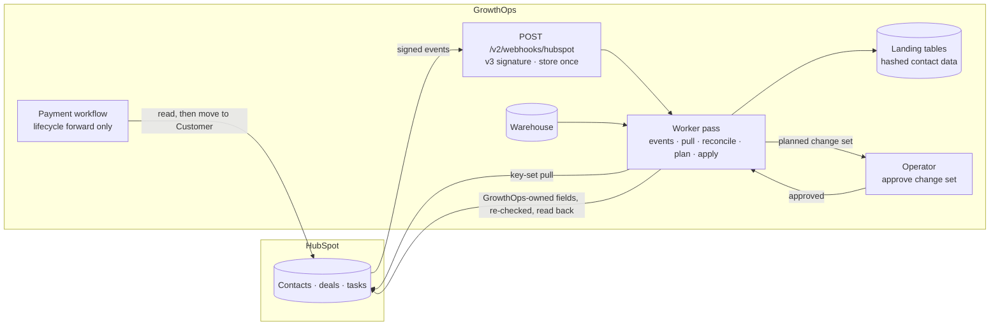

# HubSpot in production

How GrowthOps and HubSpot stay in step once a portal is live: who owns which field, how changes move each way,
what happens when something fails, and how an operator runs it. The evidence from the live developer test account
is in [the sync record](hubspot-sync.md), [the portal build](hubspot-portal.md) and
[the product and support build-out](hubspot-buildout.md); every field rule is in [the field contract](hubspot-contract.md).

## The shape of it

**Pull is the source of truth, events are hints.** A webhook only says which record changed; the worker reads that
record's current state from HubSpot and lands it, so a duplicated, late or out-of-order event can never write an old
value. The scheduled incremental pull catches anything a webhook missed.

**Push is planned, approved, re-checked and read back.** Reconcile compares the landed portal with the warehouse field
by field. Only fields GrowthOps owns become a change set, and nothing is written until a named person approves it.
At apply time each value is re-read: if a rep changed it after the plan, it is a conflict and is skipped, never
overwritten. Every write is read back and marked verified.

## Who owns what

| Owner | Fields | GrowthOps may |
|---|---|---|
| HubSpot | identity (email, names), owner, every deal field (name, amount, stage, pipeline, close date) | read; set on create during a migration |
| GrowthOps | the `growthops` property group: attribution, net cash, tracking status, funnel dates, renewal due date and risk | read and write |
| Shared | `lifecyclestage` | move forward only (a cleared payment moves a contact to Customer) |

A HubSpot-owned field that differs from the warehouse is **divergence**: reported, never pushed. On the live portal
that is the 29 rep assignments the portal's own lead routing made after the load.

## Production guarantees, and the test that holds each

| Concern | What the integration does | Test |
|---|---|---|
| Records changing mid-scan | Key-set pages (`hs_object_id` for a full pull, the modified date for an incremental one); never offset paging, which skipped two contacts on the first live pull | `test_records_edited_mid_scan_are_neither_skipped_nor_doubled` |
| HubSpot's 10,000-result search limit | Key-set pages never page past it | `test_more_records_than_a_page_sharing_one_modified_time_are_all_read` |
| Search indexing lag | Every incremental pull re-reads a five-minute overlap; landing is idempotent | `test_an_incremental_pull_reads_only_what_changed_after_the_overlap` |
| Overwriting a rep's edit | Re-read before write; a changed value is a conflict and is skipped | `test_a_value_a_rep_changed_after_the_plan_is_a_conflict_not_an_overwrite` |
| Writing a field GrowthOps does not own | Refused by the contract before any request | `test_contract_gives_hubspot_the_crm_record_and_growthops_its_analytics` |
| Lifecycle stage moving backwards | Forward only, in reconcile, apply and the payment adapter | `test_lifecycle_only_moves_forward`, `test_hubspot_adapter_moves_lifecycle_forward_and_classifies_errors` |
| Duplicate work | Content-addressed change sets; applying twice writes nothing; tasks logged and searched before create | `test_drift_is_planned_approved_applied_verified_and_never_applied_twice`, `test_renewal_tasks_are_created_once_even_after_a_crash` |
| Partial batch failure (HTTP 207) | Each failed record recorded with HubSpot's category; the rest applied | `test_errors_carry_category_properties_and_correlation_never_values_or_token` |
| Rate limits | Paced under 190 requests per 10 seconds; `Retry-After` honoured; optional daily floor | `test_client_waits_as_long_as_retry_after_asks_and_stops_at_the_daily_floor` |
| A provider that is down | Circuit breaker opens after repeated exhausted retries, closes after a cool-down | `test_client_opens_its_circuit_after_repeated_exhausted_retries` |
| Webhook forgery or replay | HubSpot v3 signature over method, public URI, body and timestamp; five-minute window | `test_v3_signatures_verify_and_reject_tampering_replay_and_other_secrets` |
| Webhook retries | Each `eventId` stored once; transient refetch failures stay pending | `test_events_are_stored_once_and_refetched_rather_than_trusted`, `test_a_transient_failure_leaves_events_pending` |
| Personal data | Contact fields landed as a keyed hash; a HubSpot privacy deletion removes the landed record | `test_a_full_pull_lands_every_record_with_contact_data_hashed`, `test_events_are_stored_once_and_refetched_rather_than_trusted` |
| Error messages leaking data | Category, property names and correlation ID only; never response text or the token | `test_errors_carry_category_properties_and_correlation_never_values_or_token` |
| The wrong portal | A pinned portal ID and a test-account guard; the worker records a refusal instead of exiting | `test_the_worker_runs_a_sync_pass_once_per_slot` |
| Unsafe configuration | Production refuses a sync without a pinned portal, a token and a hash key, or webhooks without a public HTTPS URL | `test_production_refuses_an_unpinned_or_unhashed_hubspot_sync` |
| A sync that silently stops | `/ready` reports the sync stale after three missed intervals or while its last run failed | `test_readiness_reports_a_stale_or_failing_sync` |

## Configuration

| Variable | Purpose |
|---|---|
| `HUBSPOT_ACCESS_TOKEN` | The portal's private-app or service key. From a secret manager in production; never logged or stored. |
| `GROWTHOPS_HUBSPOT_PORTAL_ID` | The one portal this deployment may touch. Required in production. |
| `GROWTHOPS_HUBSPOT_SYNC` | `on` runs a sync pass in the worker. |
| `GROWTHOPS_HUBSPOT_SYNC_MINUTES` | Interval between passes (default 15). `/ready` calls the sync stale after three. |
| `GROWTHOPS_HUBSPOT_DAILY_FLOOR` | Stop before HubSpot's daily allowance falls under this (default 0, off). |
| `GROWTHOPS_PII_HASH_KEY` | 32+ character key for hashing contact data in the landing tables. Required with the sync in production. |
| `GROWTHOPS_HUBSPOT_APP_SECRET` | The HubSpot app's client secret; enables `POST /v2/webhooks/hubspot`. |
| `GROWTHOPS_PUBLIC_BASE_URL` | The public HTTPS URL HubSpot calls, so the signature can be checked behind a proxy. |
| `GROWTHOPS_CRM_ADAPTER=hubspot` | The payment workflow moves paying contacts to Customer. |

## Runbook

**First connection.** `python -m growthops.hubspot_sync preflight` checks the account type, the pinned portal and
every API the sync needs, read-only. A `missing scope` line names the capability before anything else runs.

**Routine.** The worker runs a pass every `GROWTHOPS_HUBSPOT_SYNC_MINUTES`: pending webhook events, incremental pull,
reconcile, plan, and apply of anything already approved. `GET /v2/hubspot/sync` (operator role) shows watermarks,
landed records, the webhook backlog and recent change sets; `/metrics` exposes the same as gauges.

**Approving a change set.** `python -m growthops.hubspot_sync reconcile` shows the drift; `plan` prints the change set;
approve it with `python -m growthops.hubspot_sync approve <id> --by <name>` or
`POST /v2/hubspot/changesets/{id}/approve` (ops token and `X-GrowthOps-Actor`, audited in `operator_actions`). The next
worker pass applies it; `apply <id>` does it now.

**A conflict.** A change-set item marked `conflict` means HubSpot changed after the plan. Nothing was overwritten. The
next reconcile plans a fresh change set from the current values if GrowthOps still owns a difference.

**A failed apply.** Re-run `apply <id>`: verified items are skipped, failed ones retried. The item's
`error_category` is HubSpot's own (for example `VALIDATION_ERROR` for an option the property does not allow).

**`BudgetExhausted` or `CircuitOpen`.** The pass stops cleanly and the job is retried on the next slot. Budget resets
with HubSpot's daily window; the circuit closes after its cool-down. Check HubSpot's status page if the circuit keeps
opening.

**Rotating the key.** Create the new key in HubSpot, put it in the secret manager, restart the API and worker, run
`preflight`, then revoke the old key. A key pasted anywhere outside the secret manager counts as leaked.

**Webhooks.** In the HubSpot app, subscribe to contact and deal creation, property change, deletion, merge and
privacy deletion, with the target `https://<public host>/v2/webhooks/hubspot`; set the app's client secret as
`GROWTHOPS_HUBSPOT_APP_SECRET` and the public host as `GROWTHOPS_PUBLIC_BASE_URL`.

**A GDPR deletion made in HubSpot.** The `privacyDeletion` event removes the landed record. The warehouse's own copy
of the person is a separate deletion under the warehouse's retention policy.

## What is verified live, and what is not

Verified against the live developer test account (see [the sync record](hubspot-sync.md)): preflight; full and
incremental pulls with every record landed exactly once; reconcile to the warehouse (all 959 GrowthOps contacts and 130
deals matched, HubSpot's two sample contacts reported, not deleted); a 36-value change set planned, approved, applied in
one batch, read back and verified; a re-plan that writes nothing; renewal tasks created once; the webhook processing
path (signature, deduplication, refetch) on a signed delivery for real records; the payment adapter's read path; the
product catalog, 130 line items and 8 support tickets, read back without changing a deal amount.

Not verified live: deliveries sent by HubSpot itself (they need a HubSpot app subscribed to a public URL; the receiver
and processing are tested with HubSpot's documented signature), companies (the warehouse has no company entity),
marketing consent (no consent source exists; the scenario's consent rows are a synthetic fixture), and a production
portal (every run here is against the developer test account).
